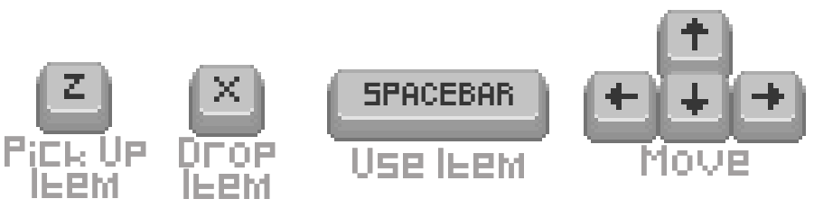
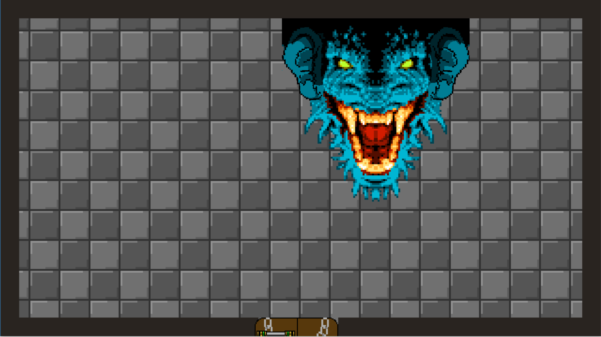
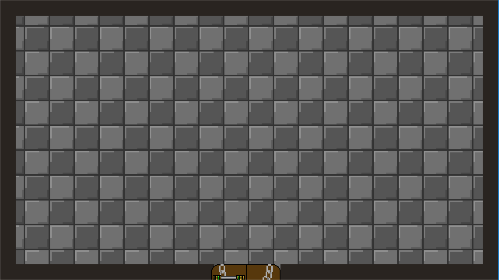

# PyQuest
## How Many Licks 'Till the Visual Novel?

*"Was that a dream... or reality?"*

---

In the autumn of 2016, fresh off the cultural phenomenon that was Broccoli Consumption Simulator, Corey Schulz asked a question that would haunt game design for years to come:

**"What if we made a Zelda-like dungeon crawler, but the final boss can only be defeated by a professional-grade nose flute?"**

The answer was **PyQuest**, and it was a mistake.

### A Game of Two Halves (And One Existential Crisis)

PyQuest doesn't deceive you. It tells you exactly what it is in the window caption: `Pyventure alpha 1.000003 handicapped edition+`. The version number alone should have been a warning. The "handicapped edition+" was a cry for help.

The game opens with classic top-down adventure gameplay. Keys to find. Puzzles to solve. Enemies to vanquish. A dragon to defeat.

And then—*and then*—you play the bocarina.

### Phase I: The Dungeon (Or: How We Learned to Stop Worrying and Love Item-Based Progression)

**The Grid-Based Room System** — PyQuest implements a sophisticated multi-room dungeon architecture spanning 12 interconnected chambers (`main.py:89-113`). Each room exists in a coordinate grid (C1, D4, A5-E6, B7, C7) with precise 1240x680 pixel offsets. The camera doesn't follow the player—the *entire world* shifts around them. It's not a scrolling viewport; it's continental drift.

**Dynamic Illumination Engine** — The game features a darkness overlay system that responds to player inventory state (`main.py:129, 456-462`). Enter room B5 without a torch? Enjoy the void. The darkness isn't just an aesthetic—it's a 1240x720 pixel sprite actively concealing the sword you need to progress. Light the brazier using a stick from the woodpile, and the darkness entity simply... stops existing. `darkness.active = False`. Entropy, reversed through boolean assignment.

**Directional Sword Mechanics** — The sword system tracks player facing direction and dynamically repositions its hitbox 100 pixels in the appropriate cardinal direction (`ItemClasses.py:125-153`). Four sprites. Four positions. One weapon that exists in superposition until you observe which way you're facing. The enemy collision detection occurs between the sword sprite and enemy sprite—meaning you're not swinging *at* enemies, you're *colliding* your weapon into them. It's not combat. It's aggressive geometry.

**Enemy Pathfinding with Personality Disorders** — Three enemy types, three AI patterns:
- **Generic Enemy**: Randomized pursuit with 5-20 pixel variance per frame (`EnemyClass.py:50-62`). Erratic. Unpredictable. Comments in code say "LET'S MAKE A CASUAL GAME WITH NO COMABT" (line 3). The typo is canon.
- **Shield Enemy**: Vertical-only movement. Can only be defeated by pushing it into a pit using the shield item. The pit's hitbox was manually reduced by 256 pixels and offset 128 pixels (`main.py:309-311`) because apparently the original pit was *too effective*.
- **Dragon**: Unkillable by conventional means. Collision results in instant death (teleportation back to spawn). Cannot be damaged. Cannot be reasoned with. Can only be defeated by...

### Phase II: The Bocarina (Or: The Moment Everything Went Wrong)

**The Professional-Grade Nose Flute.**

Hidden in room C7. A tiny brown sprite. Press Z to pick it up. Press Space to play it, and you'll hear what the game describes as "terrible" (`README_and_WALKTHROUGH.txt:7`).

The bocarina does nothing during dungeon exploration. It's a quest item in search of a quest.

Then you unlock the boss door. You enter room C1. The dragon awaits. The boss theme plays (`soundeffects/boss_fight.wav`). You approach with your sword, your shield, your ice spell—

None of it matters.

The *only* way forward is to stand before the dragon, open your inventory, and press Space on the bocarina.

`if yOff == -2040 and xOff == 0 and bocarina.pickedup:` (`main.py:434`)
`    gameplay = False`
`    visualnovel = True`

The dragon doesn't even get a death animation. The game mode just... *changes*.

### Phase III: The Visual Novel (Or: A Descent Into Metafictional Hell)

**Subtitle: "NOT THE DLC BATH SCENE WE WERE HOPING FOR"**

The visual novel opens with PROTAG declaring victory over ANTAG. The dragon dies off-screen. "YES!!" they shout. Then: *"...What happens now that I've beaten the game...?"*

The answer arrives 20 lines of dialogue later, when PROTAG wakes up in a village, is told to save the kingdom from an Empire attacking from "the East," and realizes—with mounting horror—that *the game is still going*.

**The Compass Paradox** — PROTAG asks for a compass. The villager explains that their village makes 98% of its GDP from artisanal compass sales and cannot give them away. PROTAG asks which direction East is. The villager explains that directional knowledge costs 25% of a compass but still requires payment. PROTAG has no money. The villager quotes: *"This world is full of absurdities as a matter of course."*

PROTAG strangles the villager to death.

The game presents a choice: `"Will you take VILLAGER's life? Press 'y' to make his head spin. Press 'n' to let friendship blossom."` (`dialogue2.py:55`)

But the choice comes *after the murder already happened*. The game calls this "EX POST FACTO CHOICES" and declares: "THAT'S NOT HOW DECISIONS WORK." (`dialogue2.py:56`)

**The Abandonment** — PROTAG refuses to be the protagonist anymore. The game continues anyway, filling the dialogue box with random facts:
- Congressional approval requirements for martial law
- "This visual novel would have been easier to make in PowerPoint."
- Production cycle comparisons to Final Fantasy XV
- Nutritional information about sardines
- The difference between Telnet and SSH encryption

Twenty-two in-game years pass. PROTAG stands motionless beside a tree. They haven't aged. The Empire never came. Their only companion is TREE.

PROTAG asks the tree to commit double suicide.

The tree doesn't respond.

PROTAG strangles the tree anyway.

The tree dies.

**"PYQUEST STORY MODE -- END"**

### Technical Achievements (That Should Have Stayed in the Lab)

**Triple-Surface Rendering Architecture** — Inherited from BCS1, the visual novel uses three layered surfaces: TRANSURF for UI transparency, BGSURF for backgrounds and characters, and DRAWSURF for... drawing? The code loads DRAWSURF, fills it with black, then never uses it again (`main.py:221, 284, 291`). It exists in memory, doing nothing. A monument to over-engineering.

**84-Line Dialogue Array** — Every line of the visual novel stored in a single Python list (`dialogue2.py:1-87`). No external script file. No database. Just one massive array that the counter increments through. When counter == 84, you've reached the end. When counter == 84, you've reached the tree.

**Dynamic Audio Context Switching** — Six different music tracks triggered by game state: main theme, boss theme, wind noise, bocarina noise, boss fight theme, and VN BGM (`main.py:194-199, 491-502, 586-602`). The wind plays during the opening monologue. Boss music during the dragon fight. Then silence during the strangling. Then winter wind during the 22-year wait. The audio design is *chef's kiss* unintentional brilliance.

**120 FPS Existential Crisis** — The game runs at 120 frames per second (`main.py:23`). You will experience every frame of PROTAG's descent into nihilism at buttery-smooth high refresh rates. Your suffering will be *optimized*.

### The Question PyQuest Asks

BCS1 asked: "What if eating broccoli could change the world?"

BCS2 answered: "What if you changed the world and they destroyed you for it anyway?"

PyQuest asks: **"What if the game you're playing is so badly written that the protagonist refuses to finish it?"**

And then forces you to watch what happens when a character gains genre awareness but not freedom.

Every Zelda-like mechanic—the keys, the items, the puzzles, the boss fight—is meticulously implemented. The offset math is perfect. The collision detection works. The room transitions are seamless. The dungeon is *solvable*.

And all of it exists to deliver you to a visual novel that openly mocks itself, features retroactive choice systems, and ends with botanical homicide.

### The Bocarina: A Weapon of Mass Deconstruction

Let's be clear: the bocarina is not a joke item. It's a *philosophical statement*.

You spend the entire dungeon collecting a sword, shield, and ice spell. You defeat enemies. You solve puzzles. You light braziers and freeze lava. You become *competent*.

Then the game says: "Actually, the solution is a nose flute that sounds terrible."

The bocarina makes exactly one sound (`soundeffects/bocarina_01.wav`). You can play it anywhere in the dungeon. It does nothing. NPCs don't react. Enemies don't flee. Walls don't crumble.

But play it in front of the dragon—play it in the *one specific room* where `yOff == -2040 and xOff == 0`—and reality breaks.

The dragon dies instantly. Not from damage. Not from magic. From *narrative convenience*. The dialogue even calls it out: "I can't die from that." / "You're wrong! It's a 'musical instrument'!" (Note the sarcastic quotes in the code comments.)

The bocarina is a **meta-item**. It exists outside the game's physics. It's the developer's hand reaching through the fourth wall, grabbing the dragon, and declaring "this boss fight is over because I said so."

And PROTAG *knows it*. That's why they want out.

### Legacy of the Lick

There are no speedruns of PyQuest.

There are no fan theories.

There is only the tree.

The game's subtitle—"How Many Licks 'Till the Visual Novel?"—is a reference to the Tootsie Pop commercial: "How many licks does it take to get to the center?" The answer in the commercial is "the world may never know."

The answer in PyQuest is: **too many**.

You don't "beat" PyQuest. You *survive* it. You navigate 12 rooms, collect 9 items, defeat 3 enemies, and unlock 1 door, all to earn the right to watch a protagonist:
1. Defeat a dragon with a nose flute
2. Wake up in a village
3. Get lectured about compass economics
4. Commit murder
5. Receive a post-facto moral choice
6. Refuse to participate in the narrative
7. Stand still for 22 years
8. Strangle a tree
9. Die

The bocarina kills the dragon.

But it can't kill the game.

Only TREE can do that.

### The Tree (A Eulogy)

TREE appears in exactly three scenes. It has three lines of dialogue: "...", "...", "[dies]".

TREE cannot move. TREE cannot speak. TREE cannot consent to double suicide.

TREE is strangled anyway.

This is the only death in the visual novel that the player doesn't cause directly. The player pressed Space to advance dialogue. PROTAG strangled TREE. The game showed `"[dies]"`.

Then: `"PYQUEST STORY MODE -- END"`

Not "Game Over." Not "The End." Not "To Be Continued."

**"-- END"**

A dash. A space. The word END. No punctuation. No fanfare. Just cessation.

TREE died so the game could stop.

TREE is the real hero of PyQuest.

---

## PyQuest - where nose flutes kill dragons and trees die for our sins

*"Will this never end?"*
*"Am I doomed to walk this village eternally...?"*

Built with Python. Rendered with Pygame. Experienced with regret.

**Noveltry Studios** didn't just make a game. They made a warning.

---

### Gameplay Instructions

- Arrow keys: Move
- Z: Pick up item
- X: Drop item
- Space: Use item / Advance dialogue
- Esc: There is no escape

**Objective**: Find three keys. Unlock the door. Defeat the dragon with a bocarina. Witness the consequences of your actions.

**Estimated playtime**: 20-40 minutes + 22 years

**Trigger warnings**: Strangling, absurdist economics, bad game design as narrative device, trees

---

*A VISUAL NOVEL BUT NO BATH SCENES*
*Coming Spring 2018*
*(Narrator: It did not come Spring 2018)*
